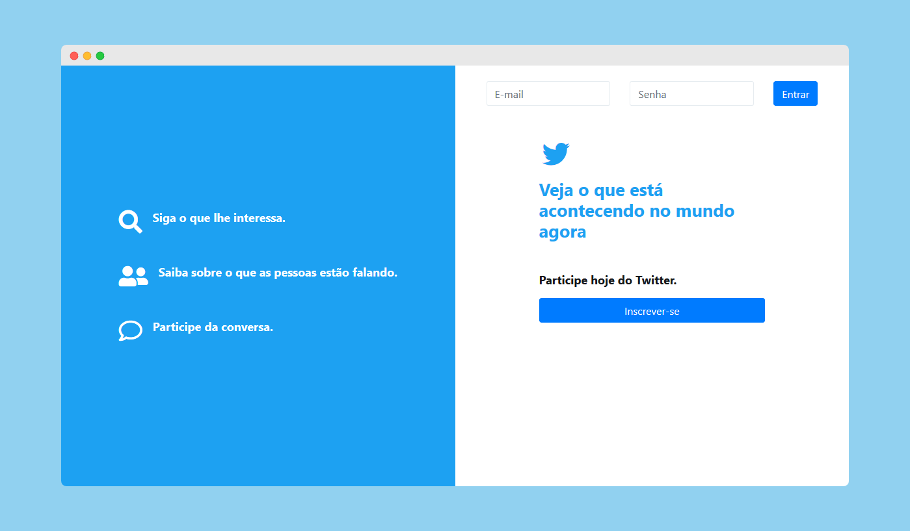

# Projeto Twitter Clone
Este projeto foi feito em um curso de desenvolvimento web para o estudo e prática de PHP OO, PHP 7 com PDO & MySQL

## Funções
- Registro de usuários
- Autenticação de usuários
- Incluindo criptografia MD5 para senha de usuários
- Criando a Timeline, incluindo e listando Tweets
- Pesquisando por outros usuários
- Seguindo e deixando de seguir outros usuários
- Exibir tweets de outros usuários na timeline

## Algumas Ferramentas Utilizadas no Projeto
- [x] HTML5
- [x] Bootstrap
- [x] Font Awesome
- [x] Composer
- [x] PHP 7
- [x] MySQL

